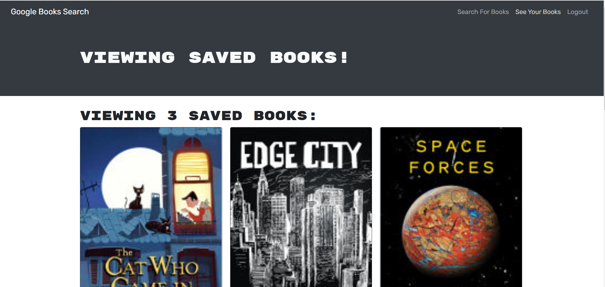

# Book Finder

 This is a fully functioning Google Books API search engine built with GraphQL API and  Apollo Server. The app was built using the MERN stack, with a React front end, MongoDB database, and Node.js/Express.js server and API. It allows users to save book searches to the back end.

## Deployed URL

https://guarded-fortress-76077.herokuapp.com/

 ## Stacks/Techs Used
* Javascript
* Node.js
* PWA
* React.js
* MongoDB
* Express JS

## Installation

Install the following node packages on command line before you start the app if you would like to use it locally.
  

`npm install`
  
## Usage   
  
Run the following commands at the root of your project if you would like to use it locally.

`npm run develop`

## Screenshots

## Contribution
Made by [Mehmet B Huyuk]
